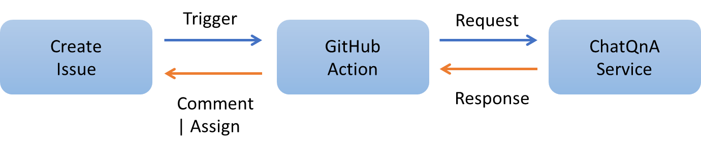

# GitHub issue Auto reply

## Description
GitHub issue Auto reply workflow is a real use case for ChatQnA. 
This workflow is designed to automatically comments answers and add assignees to the GitHub issues with the most relevant feedback from the ChatQnA knowledge base. 
The workflow uses the GitHub API to fetch the issue details and the ChatQnA API to get the most relevant answers/assignees, then posts the answers/assignees to the GitHub issue.

## Workflow

## Issue Template 
During the workflow study, we found not all issues can get a reasonable answer form the ChatQnA knowledge base. If we auto-rely for all the issues some answers may not be helpful a
nd even misleading the users to the wrong direction. So to avoid those bad user experience we decide to add issue templates to help the workflow to filter the issues.  
We suggest to create 3 templates, one for each of the following categories: Bug report, Feature request, Questions. 
The workflow will auto-assigned the **Bug report** and **Feature request** issue to the most relevant assignee and auto-relied the **Questions** issue with the most relevant answer from the ChatQnA knowledge base.

Please copy those template into your repository, [Bug report](), [Feature request](), [Questions]().

## GitHub Action Setup
- Copy the [actions](./actions) into your GitHub project under the `.github` folder.
- Add the following secrets to your GitHub repository:
  - `TOKEN`: GitHub token to access the GitHub API.
  - `CHATBOT_SERVER`: ChatQnA server URL.
  - `MAINTAINER`: Auto assign the issue to the maintainer if no proper assignee found.

## ChatQnA Service Setup
TODO

## Test the Workflow
- Create a new issue in your repository with the title.
- Check the issue comments or assignee from `NeuralChatBot`.